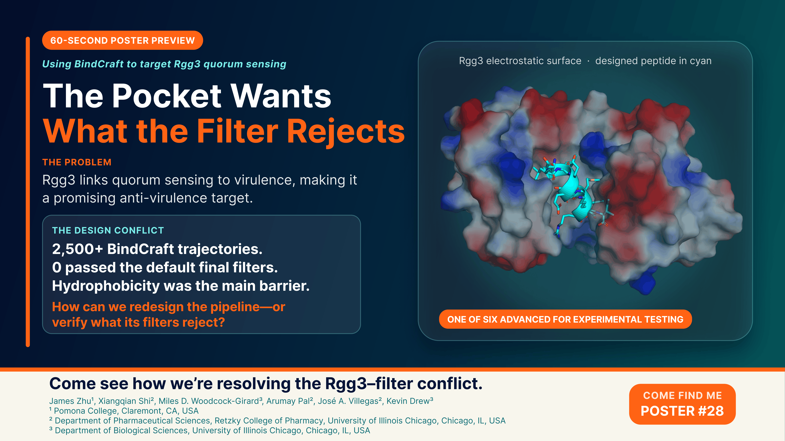
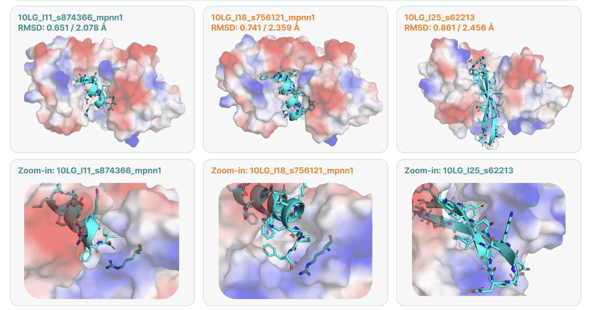

# BindCraft Design of Peptide Binders Against 10LG (Rgg3)

**BindCraft-guided de novo design of peptide binders targeting the bacterial quorum-sensing regulator Rgg3**

James Zhu¹, Xiangqian Shi², Miles D. Woodcock-Girard³, Arumay Pal², José A. Villegas², Kevin Drew³

¹Pomona College, Claremont, CA, USA
²Department of Pharmaceutical Sciences, Retzky College of Pharmacy, University of Illinois Chicago, Chicago, IL, USA
³Department of Biological Sciences, University of Illinois Chicago, Chicago, IL, USA

[](poster_lightning_slide.pdf)

Full conference poster: [`RosettaCon_poster.pdf`](RosettaCon_poster.pdf)

---

## Background: Rgg3, 10LG, and this round of design

*Streptococcus* species cause diseases ranging from pharyngitis to invasive infections, and rising antibiotic resistance has made anti-virulence strategies — suppressing pathogenicity without inhibiting bacterial growth — an attractive alternative to conventional antibiotics. The quorum-sensing transcription factors Rgg2 and Rgg3 regulate virulence-associated genes through interactions with short hydrophobic peptide (SHP) pheromones, making the SHP-binding interface of Rgg3 a promising therapeutic target.

In prior work, BindCraft was used to design short helical peptide binders against the SHP-binding interface of Rgg3, yielding potent inhibitors of Rgg3-mediated quorum sensing. The X-ray co-crystal structure of the highest-affinity peptide bound to Rgg3 was subsequently solved — this is **[10LG](https://www.rcsb.org/structure/10LG)**, the *Streptococcus thermophilus* SHP pheromone receptor Rgg3 in complex with Rgg3bp13.

**This part of the repo is the second round of design**, using the 10LG structure as the starting point to search for improved, second-generation Rgg3 inhibitors. Thousands of independent BindCraft trajectories were generated and evaluated computationally (structural confidence, interface quality, and sequence-based metrics) to identify high-confidence peptide candidates, six of which were advanced to experimental functional assays.

---

## Directory

```
bindcraft_design_10LG/
├── README.md
├── poster_lightning_slide.png
├── poster_lightning_slide.pdf
├── RosettaCon_poster.pdf
├── design_pipeline.png
│
├── config/
│   ├── 10LG_1.json
│   ├── 10LG_2.json
│   └── 10LG_3.json
│
├── raw_designs/
│   └── all_design_stats.xlsx
│
└── selected_designs/
    ├── Selected Design.xlsx
    └── structures/
        ├── 10LG_l11_s874366_mpnn1_model1.pdb
        ├── 10LG_l11_s874366_mpnn1_model2.pdb
        ├── 10LG_l14_s250321.pdb
        ├── 10LG_l15_s754775.pdb
        ├── 10LG_l16_s122031.pdb
        ├── 10LG_l17_s37923.pdb
        ├── 10LG_l18_s756121_mpnn1_model1.pdb
        ├── 10LG_l18_s756121_mpnn1_model2.pdb
        ├── 10LG_l22_s178631_mpnn2_model1.pdb
        ├── 10LG_l22_s178631_mpnn2_model2.pdb
        ├── 10LG_l25_s62213.pdb
        └── sample_designs.png
```

---

## Pipeline & Initial Configuration


BindCraft's default pipeline (with the trajectory-logging patch described in [`../bindcraft_analysis/`](../bindcraft_analysis/README.md)) was run against the 10LG structure, targeting the SHP-binding interface, using **short peptide lengths (10–25 residues)** rather than the larger binder lengths BindCraft is typically run with.

Three separate BindCraft settings files define the trajectory parameters used across this campaign, all targeting the same 10LG structure and peptide length range but with different hotspot residue definitions on the SHP-binding pocket:

| Config file | Cluster design path | Target hotspot residues | Length range | Final designs |
|---|---|---|---|---|
| [`config/10LG_1.json`](config/10LG_1.json) | `10LG_1/` | 84, 156, 272, 279| 10–25 | 100 |
| [`config/10LG_2.json`](config/10LG_2.json) | `10LG_2/` | 84, 152, 159  | 10–25 | 100 |
| [`config/10LG_3.json`](config/10LG_3.json) | `10LG_3/` | none — unrestricted search | 10–25 | 100 |

(The cluster output folder names above come directly from each config's `design_path` field and don't line up numerically with the local config filenames — that's expected, not an error, since the configs were renamed locally after the runs.)

Across these runs, thousands of independent design trajectories were generated and logged, forming the raw pool that was then computationally filtered.

---

## Challenges

### The Design Conflict: What the Pocket Wants vs. What the Filter Rejects

**The problem.** Rgg3 links quorum sensing to virulence, making it a promising anti-virulence target — but its SHP-binding pocket is deeply buried, and a deeply buried pocket naturally favors a hydrophobic surface to bind against.

**The conflict.** Binding that pocket well requires a peptide with substantial hydrophobic character at the interface. But because these binders are so short (10–25 residues), most of a peptide's residues *are* the surface — there isn't much scaffold to bury hydrophobic residues away from solvent the way a larger protein binder could. So a peptide built to satisfy the pocket ends up looking, overall, like a highly hydrophobic peptide — exactly what BindCraft's default filters are tuned to reject (they penalize high surface hydrophobicity as a proxy for aggregation/solubility risk).

**The numbers.** Over 2,500 BindCraft trajectories were run against 10LG. **Zero** passed BindCraft's default final filters.

**Our response.** Rather than accept zero designs, we went back into the full trajectory data (`raw_designs/all_design_stats.xlsx`) and looked at *which* filter each design was actually failing. Hydrophobicity — not structural confidence, not interface quality — was consistently the blocking criterion. Using our own standard (still requiring strong confidence and interface metrics, but not auto-rejecting on the default hydrophobicity cutoff), we manually selected the top designs for experimental testing.

**Open question.** Should the pipeline itself be redesigned with a pocket-aware hydrophobicity threshold — since a buried, hydrophobic pocket structurally *requires* a more hydrophobic binder than BindCraft's default assumes — or should filter failures simply be manually verified and overridden case-by-case, as done here? This connects back to the broader question raised in [`../bindcraft_analysis/`](../bindcraft_analysis/README.md): BindCraft's filters are mostly hardcoded, and our trajectory characterization work there didn't find a clean, general signal to replace them with — this hydrophobicity case is a concrete instance of that same problem.

---

## Selected Designs

From the full pool of trajectories (`raw_designs/all_design_stats.xlsx`), candidates were filtered and ranked in [`selected_designs/Selected Design.xlsx`](selected_designs/Selected%20Design.xlsx), with the corresponding structures saved to `selected_designs/structures/`.



**Six peptide designs** were originally selected for experimental functional assays to test their ability to inhibit Rgg3-mediated quorum sensing (see abstract above). Additional promising candidates are continuing to be added to this folder as further designs are validated — the table below reflects what's currently here, not a final count.

Structures currently in `selected_designs/structures/` span peptide lengths **11–25 residues**, with some designs represented by multiple ProteinMPNN model predictions (`_mpnn1_model1` / `_mpnn1_model2`, etc.):

| Design | Length |
|---|---|
| `10LG_l11_s874366` | 11 |
| `10LG_l14_s250321` | 14 |
| `10LG_l15_s754775` | 15 |
| `10LG_l16_s122031` | 16 |
| `10LG_l17_s37923` | 17 |
| `10LG_l18_s756121` | 18 |
| `10LG_l22_s178631` | 22 |
| `10LG_l25_s62213` | 25 |

More designs to come.


